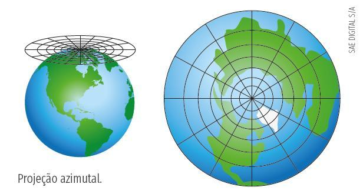

Propulsor Azimutal
====
O que significa **Azimutal** e **Porque** usá-lo
----
A palavra **azimutal** tem origem da palavra azimute, que significa, "ângulo medido no plano horizontal entre o meridiano do lugar do observador e o plano vertical que contém o ponto observado.", exemplificando, seria o plano horizontal de um observador como vemos na imagem a baixo:

 
Sendo assim uma propulsão é um conjunto de motores: 
O primeiro e o principal é o de propulsao do barco, que será responsável por fornecer aceleração e geralmente é especificado no edital do Duna.
O segundo é responsável pela rotação do motor principal no eixo azimute.

E porque foi escolhido esse sistema de controle?
Pois esse sistema substitui o uso do leme, que geralmente em embarcações comuns serve para direcionar o fluxo de água, para assim mover o barco para a direção desejada.
Dessa forma com o azimutal, conseguimos girar o motor para a direção desejada, dessa forma temos uma melhor manobrabilidade além de conseguir movimentrar o nautimodelo de formas que seriam impossíveis com um leme convencional, como por exemplo dar ré no barco.

.. image:: imagens/Azimutal_Baleia.jpg
  :width: 400
  :alt: Motor azimutal do Baleia (Duna 2022)

====
Projeto para o Kraken
----
 
Neste ano de 2023, para o Kraken decidimos fazer um sistema similar ao Baleia do ano anterior. O sistema será composto de três principais componentes:
Motores DC com encoders
Ponte H BTS####
Arduino nano

====
Motor com Encoder
----

====
Ponte H BTS####
----

====
Arduino nano
----
