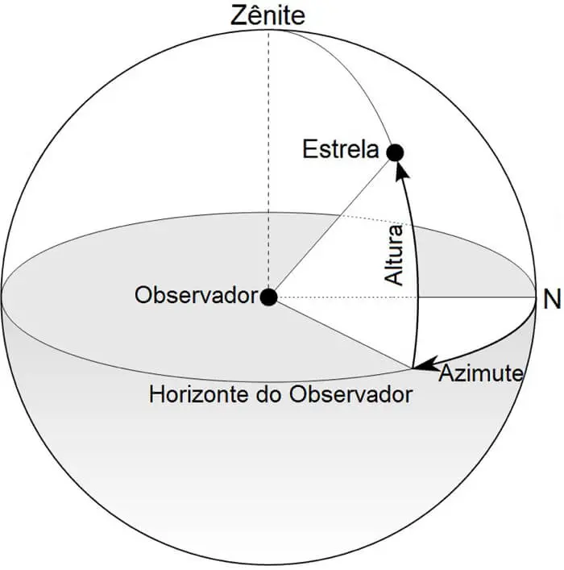
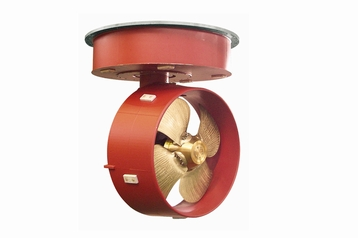
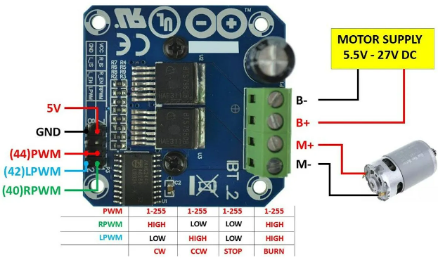

Propulsor Azimutal
====
O que significa **Azimutal** e **Porque** usá-lo
----
A palavra **azimutal** tem origem da palavra azimute, que significa, "ângulo medido no plano horizontal entre o meridiano do lugar do observador e o plano vertical que contém o ponto observado.", exemplificando, seria o plano horizontal de um observador como vemos na imagem a baixo:

 
Sendo assim uma propulsão é um conjunto de motores: 
O primeiro e o principal é o de propulsao do barco, que será responsável por fornecer aceleração e geralmente é especificado no edital do Duna.
O segundo é responsável pela rotação do motor principal no eixo azimute.

E porque foi escolhido esse sistema de controle?
Pois esse sistema substitui o uso do leme, que geralmente em embarcações comuns serve para direcionar o fluxo de água, para assim mover o barco para a direção desejada.
Dessa forma com o azimutal, conseguimos girar o motor para a direção desejada, dessa forma temos uma melhor manobrabilidade além de conseguir movimentrar o nautimodelo de formas que seriam impossíveis com um leme convencional, como por exemplo dar ré no barco.

Projeto para o Kraken
------
 
Neste ano de 2023, para o Kraken decidimos fazer um sistema similar ao Baleia do ano anterior. O sistema azimutal será composto de três principais componentes:

* Motores DC com encoders
* Ponte H BTS7960
* Arduino nano

Motor com Encoder
------

É simplesmente como o nome sugere, um motor dc com um sistema de encoder, sistema esse responsavel pelo sensoreamente do motor em si, para dessa forma realizar controle sob o motor, ou seja, o encoder nos fornecerá informações sobre o motor, para calcularmos a **posição** de seu eixo ou sua **velocidade** de rotação e assim criarmos algoritimos para controlá-lo da forma desejada.

.. image:: imagens/motor_dc_com_encoder.jpg
  :width: 400
  :alt: Exemplo de Azimutal

Como vemos na imagem acima do proprio dispositivo, temos duas partes do cilindo, a primeira e mais perto do eixo é um sistema de engrenagens para redução e a segunda e maior é o sistema eletromagnético do motor junto com os dispositivos de sensoriamente, que são nada mais que sensores de efeito hall, também vemos as suas conexões que são 6 pinos. Esses pinos são mostrados abaixo:

.. note:: Um sistema de engrenagem de redução servem para diminuir a velocidade de rotação do eixo, por exemplo, enquanto o eixo do motor gira em 750 RPM, e temos um sistema de engrenagens 1:75, o eixo final da caixa de redução irá girar em 1 RPM.

.. image:: imagens/conexao_motor_dc.png
  :width: 400
  :alt: Exemplo de Azimutal

Sendo da seguinte forma:

* os pinos 1 (M1) e 6 (M2) são pinos de tensão para o motor

* os pinos 2 (GND encoder) e 5 (3.3v encoder) são pinos de tensão para o encoder

* por fim e não menos importante os pinos 4 (C1) e 5 (C2) são pinos de dados do encoder/sensor 

Ponte H BTS7960
------

Escreva aqui

Arduino nano
------

Escreva aqui

Esquema de Conexões 
------

Escreva aqui
