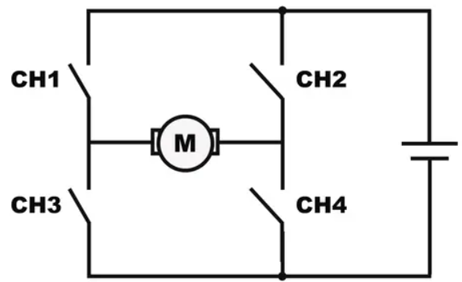
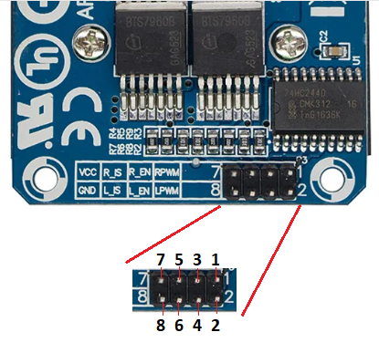
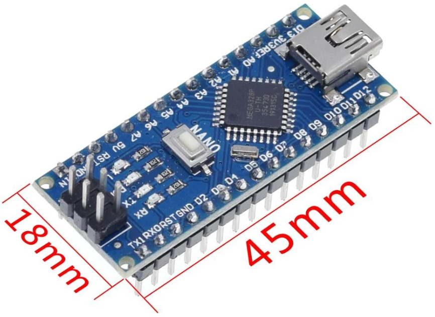

Propulsor Azimutal
====
O que significa **Azimutal**? e **Porque** usá-lo?
----
A palavra **azimutal** tem origem da palavra azimute, que significa, "ângulo medido no plano horizontal entre o meridiano do lugar do observador e o plano vertical que contém o ponto observado.", exemplificando, seria o plano horizontal de um observador como vemos na imagem a baixo:

.. image:: imagens/azimute-e-altura.webp
  :align: center
  :width: 200
  :alt: Projeção Azimutal (referência)
 
Sendo assim, uma propulsão é um conjunto de motores: 
O primeiro e o principal é o de propulsão do barco, que será responsável por fornecer aceleração e é geralmente especificado no edital do Duna.
O segundo é responsável pela rotação do motor principal no eixo azimute.

E por que foi escolhido esse sistema de controle?
Pois esse sistema substitui o uso do leme, que geralmente em embarcações comuns serve para direcionar o fluxo de água, para assim mover o barco para a direção desejada.
Dessa forma, com o azimutal, conseguimos girar o motor para a direção desejada, dessa forma temos uma melhor manobrabilidade além de conseguir movimentar o modelo de formas que seriam impossíveis com um leme convencional, como, por exemplo, dar ré no barco.

.. image:: imagens/Ex_motor_azimutal.jpg
  :align: center
  :width: 300
  :alt: Exemplo de Azimutal

Projeto para o Kraken
------
 
Neste ano de 2023, para o Kraken decidimos fazer um sistema similar ao Baleia do ano anterior. O sistema azimutal será composto de três principais componentes:

* Motores DC com encoders
* Ponte H BTS7960
* Arduino nano

Motor com Encoder
------

É simplesmente como o nome sugere, um motor dc com um sistema de encoder, sistema esse responsável pelo sensoreamento do motor em si, para dessa forma realizar controle sob o motor, ou seja, o encoder nos fornecerá informações sobre o motor, para calcularmos a **posição** de seu eixo ou sua **velocidade** de rotação e assim criarmos algorítimos para controlá-lo da forma desejada.

.. image:: imagens/motor_dc_com_encoder.jpg
  :align: center
  :width: 400
  :alt: Motor de Corrente Continua com Encoder

Como vemos na imagem acima do próprio dispositivo, temos duas partes do cilindro, a primeira e mais perto do eixo é um sistema de engrenagens para redução e a segunda e maior é o sistema eletromagnético do motor junto aos dispositivos de sensoriamento, que são nada mais que sensores de efeito hall, também vemos as suas conexões que são 6 pinos. Esses pinos são mostrados abaixo:

.. note:: Um sistema de engrenagem de redução servem para diminuir a velocidade de rotação do eixo, por exemplo, enquanto o eixo do motor gira em 750 RPM, e temos um sistema de engrenagens 1:75, o eixo final da caixa de redução irá girar em 1 RPM.

.. _Pinagem:

=====
Pinagem
=====
.. image:: imagens/conexao_motor_dc.png
  :align: center
  :width: 400
  :alt: Pinagem do Motor

Sendo da seguinte forma:

* os pinos 1 (M1) e 6 (M2) são pinos de tensão para o motor

* os pinos 2 (GND encoder) e 5 (3.3v encoder) são pinos de tensão para o encoder

* por fim e não menos importante os pinos 4 (C1) e 5 (C2) são pinos de dados do encoder/sensor 

Ponte H BTS7960
------

Ponte H é um circuito eletrônico de potência, ele é um chopper de classe E, mas deixando de lado essa parte teórica, vamos explicá-la de forma prática.
A ponte H tem esse nome por que é composto por um conjunto de chaves, sendo que o motor (load) fica no meio entre elas, veja a imagem abaixo:

  
Esse circuito serve para o controlar motores de corrente contínua, fazendo-os girar tanto no sentido horário, quanto no sentido anti-horário, além de possibilitar a controle de velocidade de rotação do motor.
Nesse projeto do Kraken, utilizaremos o modelo BTS7960, o driver dessa ponte H é apenas metade da ponte, portanto é utilizado dois drivers como veremos na figura abaixo (os drivers são o encapsulamentos quadrados), escolhemos esse modelo pois, ela aguenta uma corrente bem alta de até 43 A, funciona em um intervalo de tensão de 5 V ~ 45 V, além disso tem uma faixa de controle PWM de 25 kHz e por fim proteção de temperatura, tensão e corrente altas.

.. image:: imagens/Ponte_H_bts.png
  :align: center
  :width: 400
  :alt: Ponte H BTS7960
  
.. _Pinagem:

=====
Pinagem
=====

Agora falando sobre pinagem, vemos que ele possui 8 pinos de controle e são utilizados da seguinte forma:

* Pinos 8(GND) e 7(VCC): conectados no microcontrolador sendo GND e 5V, respectivamente (INPUT VOLTAGE)

* Pinos 6(L_IS) e 5(R_IS): são pinos de monitoramento de corrente em cada sentido de rotação (OUTPUT) 

* Pinos 4(L_EN) e 3(R_EN): controlam o sinal de enable em cada sentido de rotação (HIGH/LOW INPUT)

* Pinos 2(LPWM) e 1(RPWM): controlam a velocidade do motor em cada sentido de rotação (ANALOG/PWM INPUT)

.. note:: NUNCA LIGUE OS PINOS 4 e 3 , 2 E 1 NO HIGH AO MESMO TEMPO. quando queremos liga o motor no sentido horário mandamos um sinal de tensão para RPWM e um sinal de GND (0v) para o LPWM, e para o sentido oposto basta fazer a logia oposta. Os pinos 4 e 3 são apenas enables, ou seja, apenas iram habilitar a saida LPWM e RPWM, como se fosse um interruptor. 
  
Arduino nano
------

Escreva aqui

.. image:: imagens/arduino_nano_pins.jpeg
  :align: center
  :width: 400
  :alt:  Pinagem do Arduino

Esquema de Conexões 
------

Escreva aqui
