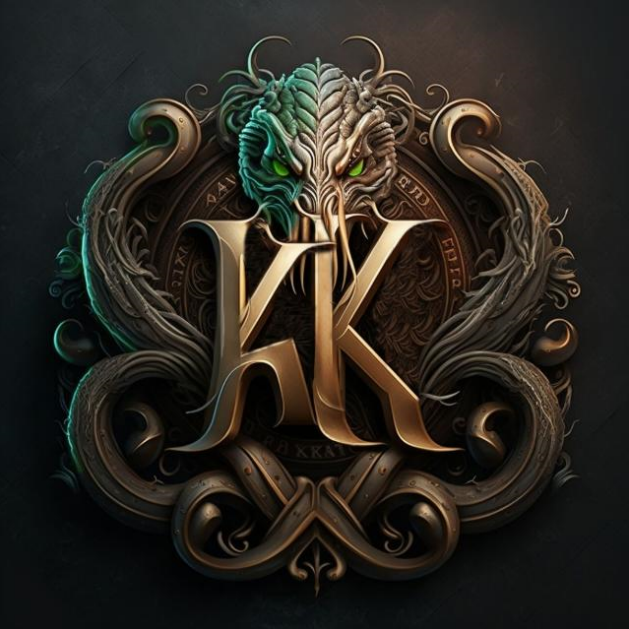

=====
Kraken
=====

Esse é um dos projetos do `Poli Náutico <https://docs.polinautico.com>`_

--------

.. toctree::
   :hidden:

   casco
   propulsao
   azimutal
   sensores
   radio_controle
   motor
   Voltar ao início <https://docs.polinautico.com>
   
Ahoy! Bem vindo ao Kraken, maraujos!
Nesta guia, iremos mostrar todo o projeto de criação do nosso mais novo rebocador de alta performance: o Kraken.

A ideia
============
Os primeiros trabalhos do Poli Náutico como equipe de competição são os rebocadores, conhecidos pelos seus nomes referentes a personagens míticos, históricos e literários: João Cândido, Álvaro de Campos, Baleia, entre outros.

Esses rebocadores competem no Desafio Universitário de Nautidesign - DUNA - realizado na cidade de Joinville em Santa Catarina, organizado pela Universidade Federal de Santa Catarina (UFSC), do qual participamos desde 2018. Em 2023 não seria diferente, e o nosso rebocador que irá competir no DUNA é o Kraken. 

A embarcação
============
Essa embarcação deve seguir alguns parâmetros (peso, LOA, etc.) determinados pelo edital do DUNA, mas somos versáteis para fazermos algumas escolhas, uma delas, na qual tentamos sempre ser inventivos e deixar uma marca do Poli Náutico, é a da propulsão.

Sempre tentamos fugir do padrão de propulsão da nossa embarcação. Em vez de usar a propulsão em que o hélice é fixo e o leme controla as pás que movimentam-se e direcionam o fluxo de água, utilizamos propulsores azimutais, que funcionam como o conjunto hélice + leme em um dispositivo só: o hélice consegue rotacionar em seu eixo, 360º. Essa propulsão consegue minimizar perdas de fluxo d’ água, que deslocam a embarcação, e conferem maior capacidade de manobrabilidade ao modelo, de modo que ele consegue deslocar-se perpendicular aos seus bordos (de ladinho) e rotacionar no próprio eixo como uma moto aquática, por exemplo.

   .. image:: imagens/propulsaoindex.png

Além disso precisamos pensar na finalidade do nosso modelo - ele é um rebocador, portanto ele precisa ter um desempenho de força elevadíssimo, que é medido, inclusive em escala portuária, por meio do teste de “Bollard Pull” em que uma puxa-se, no lugar, uma corda, e mede-se a capacidade do barco em realizar o reboque (em tradução livre seria “tração estática”). Fora isso precisamos ponderar as outras características do barco em fazer manobras e ser veloz.

O nome
============
Kraken é um ser mitológico descrito como uma lula do tamanho de uma ilha, inicialmente descrita na Idade Média como um ser que fazia muitos navios naufragarem - o maior monstro do mar. Essa imagem foi descrita por muitas pessoas na época e reaproveitada em muitas obras ficcionais, e sua aparição rondou todo o pacífico, A melhor correspondência que temos ao Kraken na literatura de língua portuguesa é o Gigante Adamastor dos Lusíadas, de Camões, mas esse era antropomórfico, não assemelhava-se a uma lula. O Poli Náutico não quer que o Kraken seja temido, mas que sua grandiosidade como nautimodelo seja reconhecida, do seu projeto a seu desempenho na água.

   .. image:: imagens/krakenindex.jpeg
