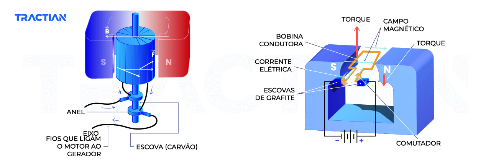
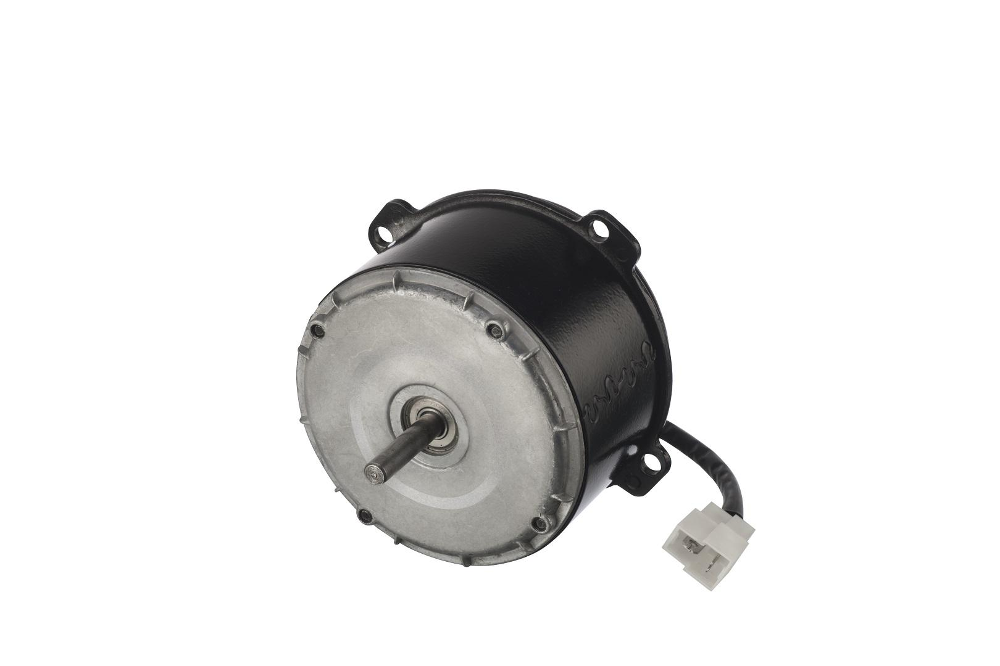
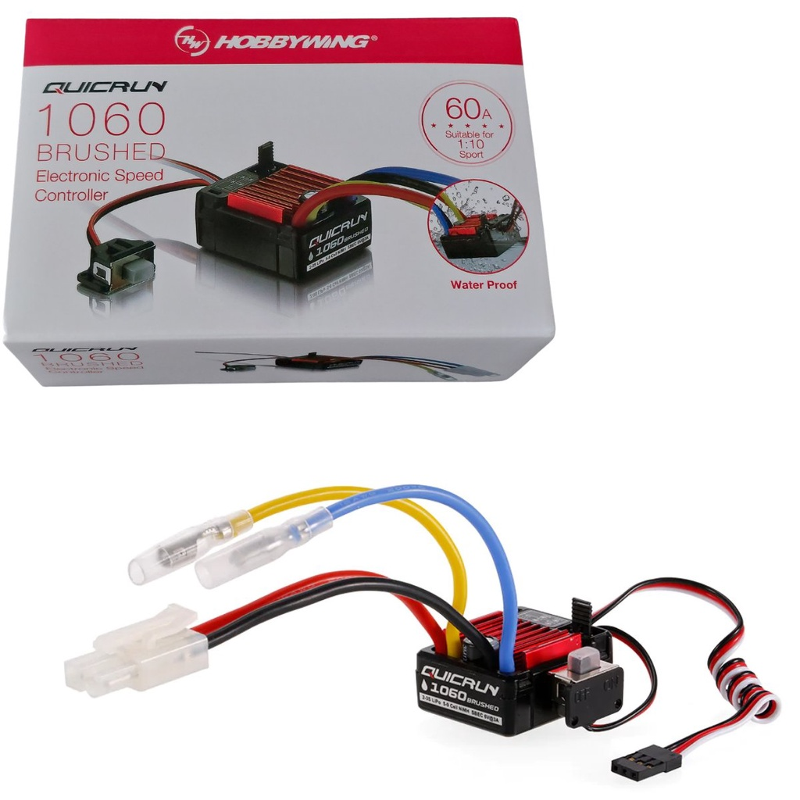

Motor
====

O Motor Elétrico
----
Os motores elétricos já estão bem presentes em nossa equipe. Graças a eles, os hélices de nossos rebocadores são capazes de realizar as rotações com a velocidade necessária e controlada.
O motor elétrico funciona com base no eletromagnetismo. Quando o motor é conectado a alguma fonte de energia (como uma bateria), a corrente elétrica gerada que passa pelas escovas e bobinas as energiza, e gera um campo magnético de polaridade igual a dos imãs em sua carcaça, fazendo com que o motor rotacione e gere energia mecânica.

Os motores elétricos DC podem ser de dois tipos diferentes:
*Brushed: duas "escovas" conectadas na fonte de alimentação acionam as bobinas e geram o campo magnético
*Brushless: possuem enrolamentos que resultam em 3 terminais de alimentação, e necessitam do auxílio de um controlador para acionar as bobinas

Imobras 101410212
----
O imobras é um motor elétrico bastante utilizado em nossos rebocadores. O motor DC 12V possui 240W e realiza 2900 RPM (em seus valores nominais). Ele também é capaz de inverter o sentido de rotação (dependendo da inversão dos fios). Nesse caso, ele é um motor brushed.

.. note:: Mais inforamções do motor podem ser encontradas em seu 'datasheet <https://www.imobras.ind.br/site-2017/ajax/action.produto-download?id=154&idArquivo=1>'_

ESC
----
O ESC, ou Eletronic Speed Controller, é um controlador de velocidade, que permite que programemos o funcionamento do motor, seja alterando a corrente ou o funcionamento das bobinas.

Existem dois tipos de ESC, que seguem a mesma lógica dos motores:
*Brushed: desempenha uma função parecida com a da Ponte H, que controla o sentido e a velocidade de rotação por PWM (Modulação por Largura de Pulso), variando a corrente que passa pelas escovas.
*Brushless: Age com um microcontrolador para controlar o chaveamento das bobinas, através do PWM

No nosso caso, utilizamos um ESC Brushed 1060.

