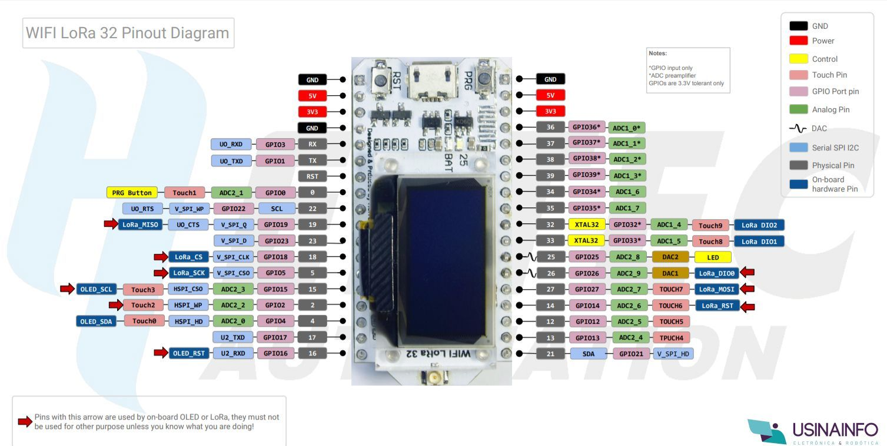

=====
Sensores e Telemetria
=====

O que é Telemetria?
-----
A telemetria é uma tecnologia que permite a medição e comunicação de informações e dados de interesse do operador, podendo monitorar e controlar determinado produto.
A telemetria é realizada, de modo geral, através de comunicações sem fio, como sinais de rádio, satélite, fibra óptica, entre outras tecnologias. Essas informações são enviadas e monitoradas em tempo real através de uma central, e esses dados são armazenados em um banco de dados. A telemetria pode realizar não só a leitura e monitoramento, mas também realizar comandos remotos pelos operadores. Essa tecnologia oferece eficiência, segurança na operação e pode ajudar a evitar penalidades, como a perda de água.
Como exemplos de aplicação, essa tecnologia está presente na agricultura, em sistemas de informação, no sistema metroviário e até mesmo em corridas de fórmula 1, que nesse caso, ela é usada para monitorar em tempo real a situação dos componentes dos carros.

.. image:: imagens/telemex.png
  :align: center
  
No caso do nosso rebocador, utilizaremos a telemetria para monitorar o que está havendo com a parte elétrica, afim de entender o desempenho da embarcação.

A Telemetria do Kraken e dispositivos
-----
Para o Kraken, utilizaremos a telemetria para monitorar a tensão e a temperatura dos componentes elétricos utilizando:

* Sensor de Tensão DC 0 a 25V
* Sensor de Temperatura MAX6675 Termopar Tipo K
* ESP LoRa 32 V2

Sensor de Tensão DC 0 a 25V
-----
Como o nome diz, é um sensor que mede a tensões contínua (VDC) na faixa de 0V a 25V. Ele funciona da seguinte forma:
Na entrada do módulo, pode ser conectado um valor de tensão DC até cinco vezes maior que o VCC da porta analógica.
Nele, há dois pinos para o VCC e GND, e um pino (S) para a porta analógica do microcontrolador fazer a leitura.

.. image:: imagens/tensaosens.png
  :align: center
  :width: 300

.. note::  A resolução do ADC (conversor analógico digital) do arduino é de 10 bits, portanto, a resolução do sensor de tensão será de 0,00489V (5V / 1023). Logo, a tensão mínima na entrada para que o sensor possa realizar a leitura é de 0,02445V.

Sensor de Temperatura MAX6675 Termopar
-----
O Termopar é um sensor que mede a temperatura que tem a capacidade de ler de 0°C a 300°C, através de dois metais distintos que são unidos e ligados a um dispositivo que tenha capacidade de ler a temperatura. Se há uma diferença de temperatura entre a extremidade unida e as extremidades livres, uma diferença de potencial surge e se o Termopar estiver conectado ao dispositivo que tenha capacidade de interpretar o sinal (no nosso caso, o ESP32), um valor de temperatura correspondente será apresentado.
A sonda que faz partedo MAX6675 é revestida de aço inoxidável, com uma blindagem na ponta, o que permite que o dispositivo capte temperaturas altas.

.. image:: imagens/senstemp2.png
  :align: center
  :width: 300
 
.. image:: imagens/senstemp1.jpg
  :align: center
  :width: 500

.. note:: O sensor tem uma biblioteca própria, que é a "max6675.h"

Na questão dos pinos, ele possui os seguintes para se comunicar com o microcontrolador e alimentação:

* GND: Terra;
* VCC: 3V a 5,5V;
* SCK: Serial Clock input, canal utilizado para sincronizar a transmissão dos dados;
* CS: Chip Select;
* SO: Serial Data output. Também conhecido como MISO (Multiple Input Single Output);

Heltec ESP 32 LoRa (V2)
-----
A Heltec ESP 32 LoRa é uma placa semelhante ao Arduino, com seu principal diferencial sendo a conexão LoRa.

LoRa é uma tecnologia de radiotransferência e comunicação de longo alcance e baixo consumo. Semelhante a uma conexão bluetooth, ela permite que sejam criados projetos de monitoramento à longo alcance. Ela utiliza bandas de radiofrequência, o que permite que seja feita a transmissão de dados e pacotes de 3 à 15 km de distância.

A placa da Heltec possui um módulo LoRa e uma antena, o que facilita a nossa utilização da tecnologia. Além disso, ela possui conexão WiFi e Bluetooth, além de um display OLED que permite mostrar informações nele.

.. note:: Existem tutoriais para instalação da placa Heltec ESP 32 LoRa pela Internet, mas no projeto utilizamos a https://github.com/Heltec-Aaron-Lee/WiFi_Kit_series/releases/download/0.0.7/package_heltec_esp32_index.json

No projeto, utilizamos uma placa dentro da embarcação como o microcontrolador central, que comandará os azimutais (mais detalhes na guia `Radio Controle <https://docs.polinautico.com/projects/Kraken/pt_BR/latest/radio_controle.html>`_) e coletará os dados da telemetria para transmitir. Também é necessária uma placa em terra para se conectar ao computador e receber as informações.

Dashboard e Node-Red
-----
Primeiramente, precisamos detalhar como faremos para visualizar os dados da telemetria do Kraken. Nesse caso, utilizaremos uma estratégia chamada "Dashboard"

Uma dashboard é nada mais e nada menos que um painel visual que apresenta, de forma compacta e centralizada, diversas informações as quais o usuário necessite. É uma entratégia de controle utilizada para facilitar a tomada de decisões. Junto com a telemetria, a dashboard permite que tenhamos, de fato, o controle sobre as informações necessárias para o entendimento da nossa embarcação.

Ok, agora fica a pergunta: como que construímos essa dashboard?
Bom, a resposta é simples: utilizamos uma ferramenta Open-Source (isso é, Código Aberto, onde todos podem contrubuir para o desenvolvimento da mesma). E para a telemetria do Kraken, escolhemos o Node-Red.

Exemplo da interface do Node-Red:

.. image:: imagens/noderedex.png
  :align: center

O Node-Red é uma ferramenta que permite criar nodes ou "nós" para realizar certas ações, como eventos http, tcp, comunicações serial, twitter, mqtt, etc. Praticamente, ele serve para fazer uma conexão entre sua interface visual e algum dispositivo IoT.

Sua "programação" se baseia em fluxo de dados num editor web gráfico, que auxilia a conexão com esses dispositivos através de protocolos ou funções.

.. note:: É possível achar N tutoriais de como baixar o Node-Red, já que ele funciona como um "servidor" ou uma página web hospedada na sua máquina, seja ela um compputador, um celular ou um Raspberry. Nessa documentação, não trataremos sobre como baixar a ferramenta nesses dispositivos.

Em nosso projeto, utilizamos o seguinte fluxo de dados, contendo os componentes:

* Serial In: recebe os dados vindo de um componente (Heltec LoRa em terra) através de uma entrada USB ou Serial Port (as mesmas COM's que você usa para ver o Serial Monitor do Arduino);
* JSon: Node que converte os dados recebidos para json object, afim de conseguir realizar a leitura dos dados recebidos e mostrá-los na dashboard;
* Function1: recebe uma função JavaScript para analisar um String JSON e constroi um objeto JavaScript para o que descreve a String;
* Function2/Function3: recebe e filtra apenas os dados de tensão e temperatura, respectivamente, e envia aos Nodes da dashboard;
* Gauge/Chart: exibe os dados no medidor em tempo real e mostra a variação com o tempo no gráfico
